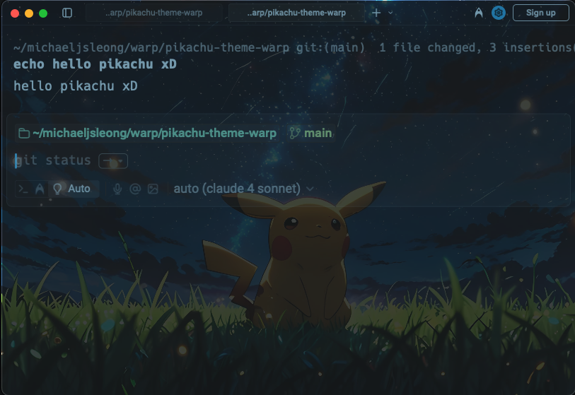

# pikachu-theme-warp
My pikachu theme for warp

```shell
# Create Warp themes directory
mkdir -p $HOME/.warp/themes/

# Download the pikachu_theme folder
# Then copy the Pikachu theme folder to your Warp themes directory
cp -r ~/Downloads/pikachu_theme $HOME/.warp/themes/
```

